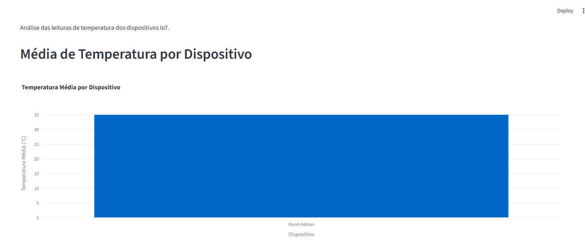
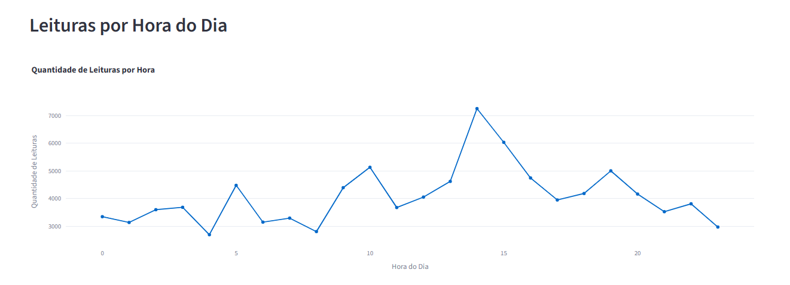
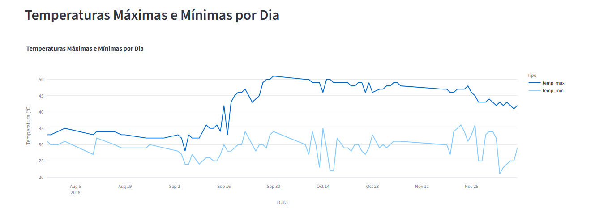

# Pipeline de Dados com IoT e Docker

## 1. Sobre o projeto

Este projeto foi desenvolvido para a disciplina **Disruptive Architectures: IoT, Big Data e IA** e tem como objetivo construir um pipeline de dados capaz de processar leituras de temperatura de dispositivos IoT, armazená-las em um banco de dados PostgreSQL executado com Docker e disponibilizar indicadores por meio de um dashboard desenvolvido com Streamlit e Plotly.

O conjunto de dados utilizado é o **Temperature Readings: IoT Devices**, disponibilizado no Kaggle.

## 2. Tecnologias utilizadas

- Python 3.14
- Pandas
- Psycopg2
- SQLAlchemy
- PostgreSQL
- Docker
- Docker Compose
- Streamlit
- Plotly
- Git
- GitHub

## 3. Estrutura do projeto

```text
projeto-iot/
│
├── data/
│   └── IOT-temp.csv
│
├── docker/
│   └── init/
│       └── 01-schema.sql
│
├── docs/
│   └── screenshots/
│       ├── 01-media-temperatura-dispositivo.png
│       ├── 02-leituras-por-hora.png
│       └── 03-temperaturas-maximas-minimas.png
│
├── sql/
│   └── views.sql
│
├── src/
│   ├── dashboard.py
│   └── load_data.py
│
├── .gitignore
├── docker-compose.yml
├── README.md
└── requirements.txt
```

## 4. Conjunto de dados

O projeto utiliza o conjunto de dados **Temperature Readings: IoT Devices**, disponibilizado no Kaggle.

Fonte:

https://www.kaggle.com/datasets/atulanandjha/temperature-readings-iot-devices

O arquivo utilizado é:

```text
IOT-temp.csv
```

O arquivo possui **97.606 registros** e as seguintes colunas:

- `id` – identificador da leitura;
- `room_id/id` – identificação do ambiente/dispositivo;
- `noted_date` – data e hora da leitura;
- `temp` – temperatura registrada;
- `out/in` – indicação de leitura interna ou externa.

## 5. Configuração do ambiente

O projeto utiliza Python e um ambiente virtual para instalação das dependências.

As bibliotecas utilizadas estão definidas no arquivo:

```text
requirements.txt
```

Instalação:

```powershell
pip install -r requirements.txt
```

Dependências principais:

```text
pandas
psycopg2-binary
sqlalchemy
streamlit
plotly
```

## 6. Banco de dados PostgreSQL com Docker

O PostgreSQL é executado em um contêiner Docker.

A configuração está disponível no arquivo:

```text
docker-compose.yml
```

Conteúdo principal:

```yaml
services:
  postgres:
    image: postgres:latest
    container_name: postgres-iot
    environment:
      POSTGRES_USER: postgres
      POSTGRES_PASSWORD: postgres123
      POSTGRES_DB: iot_db
    ports:
      - "5432:5432"
    volumes:
      - postgres_iot_data:/var/lib/postgresql/data
      - ./docker/init:/docker-entrypoint-initdb.d
    restart: unless-stopped

volumes:
  postgres_iot_data:
```

O banco utilizado no projeto é:

```text
iot_db
```

O usuário do PostgreSQL é:

```text
postgres
```

A porta utilizada é:

```text
5432
```

## 7. Tabela de leituras

A tabela principal utilizada para armazenamento dos dados é:

```text
temperature_readings
```

Estrutura:

```text
id
room_id_id
noted_date
temp
out_in
```

O arquivo responsável pela criação da estrutura inicial do banco está em:

```text
docker/init/01-schema.sql
```

## 8. Processamento e carga dos dados

O processamento do arquivo CSV é realizado pelo script:

```text
src/load_data.py
```

O script utiliza Pandas para realizar a leitura do arquivo, converter o campo de data e inserir os registros no PostgreSQL.

O campo `noted_date` possui o formato:

```text
DD-MM-YYYY HH:MM
```

Por isso, a conversão é realizada utilizando o formato:

```python
%d-%m-%Y %H:%M
```

A inserção dos dados é realizada utilizando SQLAlchemy.

Após a carga, foram confirmados:

```text
97.606 registros
```

## 9. Views SQL

Foram criadas três Views SQL para organizar os indicadores utilizados no dashboard.

O código dessas Views está disponível em:

```text
sql/views.sql
```

### 9.1 Média de temperatura por dispositivo

View:

```text
avg_temp_por_dispositivo
```

Objetivo: calcular a temperatura média registrada para cada dispositivo/ambiente.

```sql
CREATE OR REPLACE VIEW avg_temp_por_dispositivo AS
SELECT
    room_id_id AS device_id,
    AVG(temp) AS avg_temp
FROM temperature_readings
GROUP BY room_id_id;
```

Resultado observado no projeto:

```text
Dispositivo: Room Admin
Temperatura média: aproximadamente 35,05 °C
```

### 9.2 Leituras por hora do dia

View:

```text
leituras_por_hora
```

Objetivo: contabilizar a quantidade de leituras registradas em cada hora do dia.

```sql
CREATE OR REPLACE VIEW leituras_por_hora AS
SELECT
    EXTRACT(HOUR FROM noted_date) AS hora,
    COUNT(*) AS contagem
FROM temperature_readings
GROUP BY EXTRACT(HOUR FROM noted_date)
ORDER BY hora;
```

Resultado observado:

```text
14h = 7.248 leituras
```

Esse foi o maior volume de leituras registrado entre as horas analisadas.

### 9.3 Temperaturas máximas e mínimas por dia

View:

```text
temp_max_min_por_dia
```

Objetivo: apresentar as temperaturas máxima e mínima registradas em cada dia.

```sql
CREATE OR REPLACE VIEW temp_max_min_por_dia AS
SELECT
    DATE(noted_date) AS data,
    MAX(temp) AS temp_max,
    MIN(temp) AS temp_min
FROM temperature_readings
GROUP BY DATE(noted_date)
ORDER BY data;
```

## 10. Dashboard Streamlit

O dashboard foi desenvolvido utilizando **Streamlit** e **Plotly**.

O arquivo principal está localizado em:

```text
src/dashboard.py
```

Para executar o dashboard:

```powershell
.\venv\Scripts\python.exe -m streamlit run .\src\dashboard.py
```

Após a execução, o Streamlit disponibiliza a aplicação localmente, normalmente em:

```text
http://localhost:8501
```

O dashboard apresenta três visualizações principais.

### 10.1 Média de temperatura por dispositivo

Apresenta a temperatura média registrada para cada dispositivo/ambiente.

### 10.2 Leituras por hora do dia

Apresenta a quantidade de leituras registradas em cada hora do dia.

### 10.3 Temperaturas máximas e mínimas por dia

Apresenta a variação das temperaturas máximas e mínimas ao longo do período analisado.

## 11. Evidências do dashboard

### Média de temperatura por dispositivo



### Leituras por hora do dia



### Temperaturas máximas e mínimas por dia



## 12. Aplicações práticas

O pipeline desenvolvido pode ser utilizado como base para soluções de monitoramento de ambientes e equipamentos que utilizam sensores IoT.

Entre as possíveis aplicações estão:

- acompanhamento de temperatura;
- identificação de períodos com maior volume de leituras;
- comparação de temperaturas entre ambientes;
- identificação de variações térmicas;
- apoio ao monitoramento operacional;
- apoio à tomada de decisão.

Em um ambiente real, os indicadores podem auxiliar na identificação de alterações no comportamento térmico de ambientes ou equipamentos e contribuir para ações de monitoramento e manutenção.

## 13. Organização e reprodução do projeto

A organização do projeto permite separar os principais componentes da solução:

```text
data/       → conjunto de dados utilizado;
docker/     → scripts de inicialização do PostgreSQL;
docs/       → documentação e capturas do dashboard;
sql/        → Views SQL;
src/        → scripts Python;
```

O arquivo `docker-compose.yml` permite documentar a configuração do PostgreSQL utilizando Docker Compose.

O arquivo `requirements.txt` reúne as dependências Python necessárias para executar a aplicação.

## 14. Comandos Git utilizados

Inicialização do repositório:

```powershell
git init
```

Configuração do usuário:

```powershell
git config --global user.name "Carlos Antônio Soares dos Santos"
git config --global user.email "carlossantostj@hotmail.com"
```

Adição dos arquivos:

```powershell
git add .
```

Criação do commit:

```powershell
git commit -m "Projeto inicial: Pipeline de Dados IoT"
```

Configuração do repositório remoto:

```powershell
git remote add origin https://github.com/carlossantostj/projeto-iot.git
```

Configuração da branch principal:

```powershell
git branch -M main
```

Envio para o GitHub:

```powershell
git push -u origin main
```

## 15. Repositório GitHub

Repositório público do projeto:

https://github.com/carlossantostj/projeto-iot

## 16. Conclusão

O projeto integrou Python, Docker, Docker Compose, PostgreSQL, SQL, Streamlit e Plotly em um pipeline de dados aplicado a leituras de temperatura provenientes de dispositivos IoT.

A solução realiza o processamento dos dados, o armazenamento no PostgreSQL, a criação de Views SQL para organização dos indicadores e a apresentação das informações por meio de um dashboard interativo.

Os resultados obtidos demonstram a aplicação prática de técnicas de ingestão, armazenamento, consulta e visualização de dados em uma solução baseada em IoT.